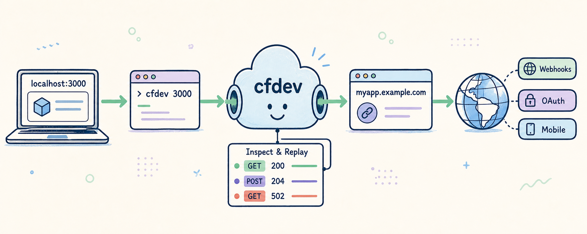

# cfdev



**cfdev gives local projects permanent URLs on your Cloudflare domain—with one browser sign-in and one command per project.**

The simplicity of ngrok, without changing URLs, copied tokens, or tunnel configuration.

```text
$ cd qtable
$ cfdev 3000

✓  Added https://qtable.example.com → localhost:3000
→  Starting the tunnel…
✓  Tunnel is running — press Ctrl+C to stop.
```

The public URL stays the same every time. Put it in webhook providers, OAuth callbacks, mobile apps, or anywhere else that needs to reach a service running on your machine.

## Why cfdev

- **Permanent project URLs.** Folder-aware shortcuts give each project a stable hostname on your domain.
- **Browser sign-in.** cfdev uses Cloudflare's normal browser authorization instead of asking you to create and paste an API token.
- **One tunnel per machine.** Every project mapping shares one efficient connector; tunnel names and UUIDs stay out of your workflow.
- **Native and cross-platform.** One small Go binary for Windows, macOS, and Linux, with no language runtime or package dependencies.
- **Agent-ready.** Every major command has stable JSON, meaningful exit codes, no surprise prompts, and retry-safe behavior.
- **Official transport.** cfdev manages Cloudflare's `cloudflared` binary rather than reimplementing the tunnel protocol.
- **Built-in request inspector.** Foreground tunnels stream compact request lines, while a loopback-only dashboard provides metadata, local targets, opt-in exact body capture, copy-as-curl, and one-shot replay to localhost.

## Install

Each release installer selects the correct architecture, verifies the downloaded binary against the release SHA-256 manifest, installs without administrator access, and adds `cfdev` to the user `PATH`.

Windows:

```powershell
irm https://github.com/deifos/cfdev/releases/latest/download/install.ps1 | iex
```

macOS or Linux:

```bash
curl -fsSL https://github.com/deifos/cfdev/releases/latest/download/install.sh | sh
```

Every version tag builds native binaries for Windows, macOS, and Linux on AMD64 and ARM64. macOS binaries are Developer ID signed, hardened-runtime enabled, and notarized by Apple on native Intel and Apple silicon GitHub runners. The release also includes `checksums.txt`, build attestations, and generated Homebrew, Winget, and Scoop definitions. Catalog commands such as `brew install deifos/tap/cfdev`, `winget install Deifos.cfdev`, and a Scoop bucket install will be enabled after their repositories accept the first public release.

Until then, build from source with Go 1.24 or newer:

```bash
go build -trimpath -o cfdev ./cmd/cfdev
```

## Quick start

Run the one-time setup:

```bash
cfdev setup
```

cfdev will:

1. Find your existing `cloudflared` installation or offer to download a checksum-verified managed copy.
2. Open Cloudflare in your browser if authentication is needed.
3. Discover the domain you authorized.
4. Create one internally named `cfdev-<machine>-<short-id>` tunnel.
5. Generate and validate the local configuration.

From any project directory:

```bash
cfdev 3000
```

The folder name becomes the subdomain. For example, running this inside `qtable-frontend` produces `https://qtable.<your-domain>`.

## Multiple computers

Run cfdev on the computer that hosts the local app. A Mac can open an app exposed from Windows without installing cfdev; install cfdev on the Mac only when the app itself runs locally there.

Each computer runs `cfdev setup` once and creates its own machine tunnel. Authenticate normally in the browser on each machine—never copy origin certificates or tunnel credential files between computers. `cfdev init` remains a compatibility alias for existing scripts.

A permanent hostname can be handed from one machine to another without changing its URL. For example, to move `screenslick.<your-domain>` from Windows to a Mac where the app uses port 3005, run on the Mac:

```bash
cfdev claim screenslick 3005
cfdev up -d
```

`claim` repoints that exact hostname only when its existing DNS target is another Cloudflare Tunnel. It refuses to overwrite unrelated DNS; `--force` remains the explicit escape hatch for a conflict you have inspected.

The folder shortcut makes normal switching automatic. In a `screenslick` checkout on either initialized machine, this command claims the project URL for the computer where it is run, updates its local port, and ensures the shared tunnel is running:

```bash
cfdev 3005 -d
```

The old computer can keep serving its other mappings, but it no longer receives traffic for `screenslick`. Running the shortcut there later moves the URL back. One hostname has one active machine tunnel at a time; cfdev does not send the same hostname to two computers simultaneously.

## Commands

```text
cfdev setup [domain]            Sign in and create this machine's tunnel
cfdev domain [domain]           Show or safely switch the active domain
cfdev reset                     Stop and forget this machine
cfdev <port>                    Add the current project and start the tunnel
cfdev add <name> <port>         Add a permanent URL
cfdev claim <name> <port>       Move a project URL to this machine
cfdev remove <name>             Remove a URL by its short project name
cfdev remove --all              Remove all project URLs after confirmation
cfdev clear                     Alias for remove --all
cfdev list                      List mappings and local health
cfdev up                        Run the tunnel with a live request feed
cfdev up -d                     Run the tunnel in the background
cfdev down                      Stop the managed tunnel process
cfdev status                    Show tunnel and local app health
cfdev open <name>               Open a permanent URL
cfdev inspect                   Open the local request inspector
cfdev config [path|edit]        Show or edit local configuration
cfdev doctor                    Diagnose setup and routing problems
cfdev upgrade                   Install the latest verified GitHub Release
cfdev version                   Print the version
```

Common flags:

```text
--json                          Stable JSON for scripts and agents
--quiet, -q                     Only print errors
--verbose, -v                   Stream detailed cloudflared output
--force, -f                     Proceed through accepted conflicts or cleanup failures
--all                           Remove every configured mapping
--yes, -y                       Accept safe setup confirmations
--detach, -d                    Run cloudflared in the background
--capture-bodies                Capture exact bodies for future inspected requests
--help, -h                      Show help
--version, -V                   Show the version
```

Foreground tunnels show cfdev's concise status followed by one compact line for every completed request. Detailed `cloudflared` output is always written to `~/.cfdev/cloudflared.log` and can also be streamed alongside the request feed with `--verbose` or `-v`.

Slow network and tunnel operations show a compact spinner in interactive terminals. Fast operations finish before the spinner appears, redirected output receives one plain progress line, and `--json` / `--quiet` remain completely animation-free. Set `CFDEV_NO_SPINNER=1` to disable terminal animation or `NO_COLOR=1` to disable color.

Running `cfdev up -d` while cfdev is attached in another terminal safely moves the same tunnel into the background; there is no longer a manual stop-and-restart step.

## Inspecting and replaying requests

The request inspector starts automatically with the tunnel and listens only on `http://127.0.0.1:4040`. Open it at any time with:

```bash
cfdev inspect
```

Request metadata is always captured: method, path, hostname, local target, response status, duration, and headers. The dashboard keeps one live list and detail pane, supports filtering, and clearly distinguishes no traffic, a stopped tunnel, and a local app that is not listening. Mapping changes and `cloudflared` restarts do not clear history because the local gateway remains alive.

The default-on **Hide framework noise** toggle removes common Next.js, Vite, and webpack development traffic such as `/_next/webpack-hmr` and `/_next/static/` from the visible list without deleting it from in-memory history. Turn it off whenever that traffic is what you are debugging. Service warnings remain visible even when history exists, response status and duration sit beside the route in the detail pane, and response headers and bodies mirror the request sections. Status colors are consistent in the terminal and dashboard: 2xx green, 3xx muted, and 4xx/5xx red.

Normal foreground operation also streams an at-a-glance request feed in the same terminal:

```text
19:55:07  GET      /health         200  2ms   → localhost:3000
19:55:12  POST     /api/webhooks   204  18ms  → localhost:3000
```

The terminal feed shows local completion time, method, path, response status, duration, and target. It deliberately omits query parameters, headers, and bodies; use the browser inspector for those details, filtering, curl generation, and replay. Replays receive a visible marker. `cfdev up -d` has no attached terminal feed, and `--quiet` suppresses it.

Exact request and response bodies are opt-in. Enable them for future traffic from the dashboard or when opening it:

```bash
cfdev inspect --capture-bodies
```

The switch is prospective—requests already in history never gain bodies retroactively. Captured bytes are preserved exactly for webhook signature debugging and formatted only for display. Each body is capped at 1 MiB, the inspector keeps at most 200 requests and 32 MiB of body data, and it evicts the oldest entries first. Truncated bodies remain inspectable but cannot be replayed.

“Replay to localhost” makes one request to the exact local target captured with the original exchange and adds a prominent **Replay** marker to the new list entry and a **Replay of #…** marker in its details. It never contacts the original webhook provider. Copy-as-curl also rewrites the URL and Host to the local target. `Authorization`, `Proxy-Authorization`, `Cookie`, and `Set-Cookie` values are redacted and omitted from replay/curl; webhook signature headers remain available. WebSocket upgrades and streaming responses pass through transparently, with metadata only and replay disabled.

If port `127.0.0.1:4040` or the gateway port is occupied, `cfdev inspect` reports the exact conflict. Normal `cfdev up` falls back to direct `cloudflared → localhost` routing with a warning so the tunnel remains usable without inspection; the browser inspector and foreground request feed are unavailable in that fallback mode.

## Removing URLs

Use the short project name shown by `cfdev list`—you never need to type the whole domain:

```bash
cfdev remove screenslick
```

For convenience, pasting the full configured hostname also works:

```bash
cfdev remove screenslick.example.com
```

Both commands remove the same mapping. If a hostname is entered without an action, such as `cfdev screenslick.example.com`, cfdev suggests the short `remove` and `open` commands instead of reporting only an unknown command. Use `cfdev clear` for confirmed bulk removal.

Running `cfdev` without arguments shows a compact dashboard:

```text
cfdev 0.1

  Tunnel  ● Running    Domain  example.com

  ●  qtable.example.com       →  localhost:3000
  ●  screenslick.example.com  →  localhost:5173
  ○  family.example.com       →  localhost:4000  app stopped
```

## Agents and automation

Once a person has authenticated in the browser, the complete daily workflow is non-interactive:

```bash
cfdev add qtable 3000 --json
cfdev up -d --json
cfdev status --json
cfdev list --json
cfdev claim qtable 3000 --json
cfdev inspect --json
```

If an agent runs `cfdev setup --json` before browser authentication exists, cfdev exits immediately with code `2`:

```json
{
  "ok": false,
  "data": {
    "interactive_command": "cfdev setup"
  },
  "summary": "Cloudflare browser authentication is required",
  "error": {
    "code": "AUTH_REQUIRED",
    "message": "Cloudflare browser authentication is required",
    "hint": "Run `cfdev setup` once to authenticate in your browser."
  }
}
```

The agent should ask the person to run that command once, then retry. `--yes` can approve installing a managed `cloudflared`, but it never bypasses browser authentication.

JSON mode writes exactly one JSON object to stdout with no colors, progress messages, or spinners:

```json
{
  "ok": true,
  "data": {
    "url": "https://qtable.example.com",
    "local_url": "http://localhost:3000"
  },
  "summary": "Added https://qtable.example.com → localhost:3000"
}
```

Exit codes:

| Code | Meaning |
| ---: | --- |
| `0` | Success or desired state already exists |
| `1` | General or Cloudflare operation failure |
| `2` | Authentication or configuration required |
| `3` | Invalid command usage |
| `4` | Missing or unsupported dependency |
| `5` | Mapping, DNS, or process conflict |

Commands are idempotent. Agents can safely retry `setup`, `domain` for the active domain, `reset` for an already reset machine, an identical `add`, removal of an already absent cfdev mapping, `up` for a running tunnel, and `down` for a stopped tunnel.

If `cfdev setup --json` cannot discover the selected zone, it returns `DOMAIN_REQUIRED` with an explicit retry command. Supplying a domain lets first-time setup continue through a transient Cloudflare discovery outage; the success result then reports `domain_validated:false` so automation does not mistake the fallback for a completed zone validation. Domain switching never uses this fallback.

Bulk deletion deliberately requires confirmation. For unattended cleanup, inspect `cfdev list --json`, then use `cfdev clear --yes --json` or `cfdev remove --all --yes --json`.

## Switching domains and resetting a machine

`cfdev domain` prints the active domain. `cfdev domain example.com` validates the selected Cloudflare zone and reuses this machine's tunnel when the domain belongs to the same account. If browser authorization is needed, cfdev preserves the current certificate by moving it to `~/.cloudflared/cfdev-cert-<domain>.pem`; switching back activates that saved certificate without copying its token.

A domain switch refuses to proceed while project mappings exist. Run `cfdev clear` first so working hostnames are never silently abandoned. Switching to a domain in another Cloudflare account is also refused: run `cfdev reset`, authenticate the other account, then run `cfdev setup <domain>`.

`cfdev reset` requires confirmation. It stops only the process managed by cfdev, removes exact DNS records that still target this machine's tunnel, deletes that exact tunnel, removes its tunnel credential, and forgets local machine state. If cleanup fails partway through, cfdev attempts to restore DNS it already removed and restart the prior background tunnel before returning the error. It preserves the browser-login origin certificate and the optional managed `cloudflared` binary. If remote cleanup is impossible, `--force` forgets local state but reports what could not be removed from Cloudflare.

## Configuration and security

cfdev owns local state under `~/.cfdev`:

```text
~/.cfdev/
├── config.json
├── cloudflared.yml
├── machine-id
├── process.json
├── cloudflared.log        tunnel diagnostics
├── inspector.json         protected local control state
├── inspector.log          inspector startup diagnostics
└── bin/cloudflared       optional managed copy
```

Cloudflare authentication remains in its normal location:

```text
~/.cloudflared/
├── cert.pem
├── cfdev-cert-<domain>.pem   saved authorization used for domain switching
└── <tunnel-id>.json
```

cfdev never prints or copies the account token contained in an origin certificate. Domain switching uses same-directory atomic moves, and reset preserves origin certificates. Inspector traffic history is memory-only and disappears when its local process stops; it is never written to the inspector log. The inspector control state contains a random shutdown/settings token and is written with user-only permissions, as are other cfdev state files on operating systems that support them.

DNS removal is deliberately narrow: cfdev deletes a record only when both the hostname and its `<tunnel-id>.cfargotunnel.com` target match. Accepting a full hostname does not broaden that ownership check. Automatic `claim` is similarly narrow: it replaces another tunnel CNAME but never an unrelated DNS record.

## Development

```bash
go test ./...
go vet ./...
go build -trimpath -o dist/cfdev ./cmd/cfdev
```

To publish a release after CI is green:

```bash
git tag vX.Y.Z
git push origin vX.Y.Z
```

The release workflow tests all supported targets, builds Linux and Windows on Ubuntu, builds and Developer ID signs each macOS architecture on its matching native GitHub runner, waits for Apple notarization, creates checksums and build attestations, renders package-manager definitions with exact hashes, and publishes one GitHub Release. A manual run performs the same build, signing, notarization, and attestation checks without publishing a release. `cfdev upgrade` uses the release metadata and refuses to install a binary that does not match its checksum. Package-managed installations direct users back to their package manager instead.

The implementation uses only the Go standard library. See [CHANGELOG.md](CHANGELOG.md) for release history and [DRAFT.md](DRAFT.md) for the approved product and technical decisions.

## Agent skill

The reusable Codex skill lives in [`skills/cfdev`](skills/cfdev). Agents can read it directly from the repository, or the folder can be installed under `~/.codex/skills/cfdev` for automatic discovery.

## Security

cfdev manages Cloudflare browser credentials and DNS for your zone. See [SECURITY.md](SECURITY.md) for reporting vulnerabilities and operator guidance. Never copy or commit origin certificates or tunnel credential files.

## License

MIT. See [LICENSE](LICENSE).
